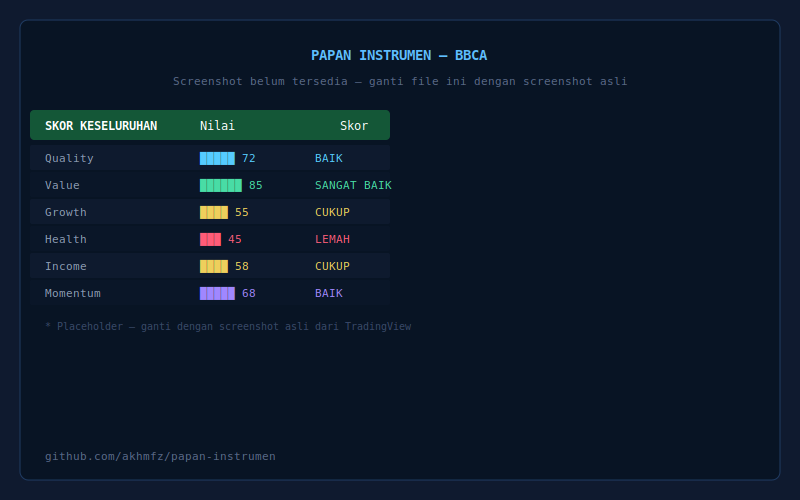

# Saham: Papan Instrumen By. Akhmfz

> All-in-One Fundamental Dashboard for Indonesian Stock Market — built with Pine Script v6.

[](https://github.com/akhmfz/papan-instrumen/releases)
[](https://www.tradingview.com/pine-script-docs/en/v6/)
[]()
[]()
[]()
[](LICENSE)

---

## Quick Start

```
1. Buka TradingView → Pine Editor
2. Copy src/PapanInstrumen.pine → Paste → Add to Chart
3. Sesuaikan sektor via Settings jika auto-detect salah
```

📖 **[Panduan Pengguna (Bahasa Indonesia)](docs/README.id.md)**

---

## Screenshot



---

## Overview

**Papan Instrumen** adalah dashboard analisis fundamental khusus **Pasar Modal Indonesia (IDX)**.

**BUKAN** rekomendasi beli/jual — ini alat bantu analisis fundamental.

### Fitur Unggulan

| Fitur | Detail |
|-------|--------|
| **7 Dimensi Scoring** | Value, Quality, Growth, Health, Income, Momentum, Indonesia Factor |
| **15 Kelas Sektor** | Bank, Asuransi, Sekuritas, Konsumer, Industri, Kesehatan, Batubara, CPO, Properti, Infrastruktur, Teknologi, Transportasi, Siklikal, Finansial, Non-Finansial |
| **Sector-Aware** | Bobot dan threshold berbeda per sektor bisnis |
| **Risk Module** | Deteksi risiko likuiditas & gorengan (terpisah dari skor) |
| **Compact Mode** | Tampilan ringkas 25-30 baris |
| **Bilingual** | 🇮🇩 Indonesia / 🇬🇧 English |
| **5 Preset Bobot** | Equal, Value-biased, Quality-biased, Growth-biased, Conservative |
| **5 Color Themes** | Gelap, Terang, Bursa Hijau, Biru Nusantara, Emas Premium |
| **89 Automated Tests** | Via PineTS — setiap dimensi scoring terverifikasi |

---

## Sector Classification (15 Kelas)

| # | Sektor | Auto-Detect | Override Manual |
|---|--------|------------|-----------------|
| 1 | Bank | ✅ Ticker list (28) + industry | ✅ |
| 2 | Asuransi | ✅ Industry field | ✅ |
| 3 | Sekuritas | ✅ Best-effort | ✅ |
| 4 | Konsumer (Makanan/Minuman) | ✅ Ticker list (19) + industry | ✅ |
| 5 | Industri (Manufaktur) | ✅ Ticker list (20) + industry | ✅ |
| 6 | Kesehatan (Farmasi) | ✅ Ticker list (15) + industry | ✅ |
| 7 | Batubara | ✅ Ticker list (16) + industry | ✅ |
| 8 | CPO & Perkebunan | ✅ Ticker list (15) + industry | ✅ |
| 9 | Properti | ✅ Ticker list (20) + industry | ✅ |
| 10 | Infrastruktur | ✅ Ticker list (14) + industry | ✅ |
| 11 | Teknologi | ✅ Ticker list (20) + industry | ✅ |
| 12 | Transportasi | ✅ Ticker list (15) + industry | ✅ |
| 13 | Siklikal (Komoditas/Energi) | ✅ Industry fallback | ✅ |
| 14 | Finansial (Umum/Legacy) | ✅ sektorRaw fallback | ✅ |
| 15 | Non-Finansial Umum | ✅ Default | ✅ |

**175+ ticker** di 9 watchlist untuk deteksi otomatis.

---

## Customization

| Fitur | Opsi |
|-------|------|
| Color Themes | 5 tema |
| Table Position | 4 pojok |
| Font Size | 3 level |
| Toggle Sections | Per dimensi (ON/OFF) |
| Custom Weights | Bobot per dimensi |
| Preset Bobot | 5 preset (Equal, Value, Quality, Growth, Conservative) |
| Compact Mode | Score-only (25-30 rows) |
| Bahasa | 🇮🇩 Indonesia · 🇬🇧 English |
| Indonesia Factor | 7th dimension (opt-in) |

---

## Repository Structure

```
build.sh                     — Build: concat modules → PapanInstrumen.pine
package.json                 — npm scripts (build, lint, test, transpile, ci)
CONTRIBUTING.md              — Cara berkontribusi
docs/
├── README.id.md             — Panduan pengguna (ID)
├── AI.md                    — AI collaboration context & workflow
├── ARCHITECTURE.md          — Arsitektur teknis, metodologi, roadmap
└── DEVELOPMENT.md           — Coding standard, testing, changelog, sprint
src/
├── modules/                 — Source modules (edit these)
│   ├── 01-base.pine         — Header, inputs, tema, utilities
│   ├── 02-data.pine         — Market engine, financial data, sektor
│   ├── 03-ui.pine           — Table & cell rendering
│   └── 04-scoring.pine      — Scoring engine + render
└── PapanInstrumen.pine      — Built output (auto-generated)
tests/
├── pinets-verify.mjs        — 12 utility function tests
├── transpile.sh             — Syntax validation via PineTS
└── scoring/                 — 77 scoring dimension tests
scripts/
├── lint.sh                  — Custom Pine Script v6 linter
└── gh-sync.sh               — Auto-create GitHub Issues
.github/
├── workflows/build.yml      — CI/CD: lint → build → transpile → test
└── ISSUE_TEMPLATE/          — Bug & feature request templates

```

---

## Development

```bash
git clone git@github.com:akhmfz/papan-instrumen.git
cd papan-instrumen
npm install          # PineTS + deps
npm run build        # Generate built file
npm run lint         # Lint check
npm run test:all     # 89 tests
npm run transpile    # Syntax validation
npm run ci           # Full CI pipeline
```

Edit `src/modules/*.pine`, run `bash build.sh`, copy `src/PapanInstrumen.pine` → TradingView.

🔬 **[CONTRIBUTING.md](CONTRIBUTING.md)** — Full dev guide.

---

## Tech Stack

| Teknologi | Penggunaan |
|-----------|-----------|
| Pine Script v6 | Core indicator |
| TradingView | Platform |
| [PineTS](https://github.com/LuxAlgo/PineTS) | Local testing & validation |
| Git + GitHub Actions | Version control + CI/CD |
| `gh` CLI | Issue management |

---

## Testing

89 automated tests via [LuxAlgo/PineTS](https://github.com/LuxAlgo/PineTS):

| Suite | Tests |
|-------|-------|
| Utility functions | 12 |
| Value (Valuation) | 14 |
| Quality (Profitability) | 15 |
| Growth | 8 |
| Health | 16 |
| Income (Dividend) | 10 |
| Momentum | 11 |
| Overall Score | 3 |
| **Total** | **89** |

```bash
npm run test:all    # ✅ 89/89 passed
```

---

## Disclaimer

**Papan Instrumen** adalah alat bantu analisis — **BUKAN** nasihat keuangan atau investasi. Skor "Risiko Likuiditas" adalah proxy statistik berbasis harga & volume historis, bukan deteksi manipulasi pasar terverifikasi. Seluruh keputusan investasi tetap tanggung jawab masing-masing pengguna.

---

## License

MIT License — lihat [LICENSE](LICENSE).

---

## Author

**Muhammad Akhmal** — Founder of AKHMFZ Analytics, Indonesia

[TradingView](https://www.tradingview.com/u/akhmfz/) · [LinkedIn](https://linkedin.com/in/Akhmfz) · akhmfz.analytics@gmail.com
