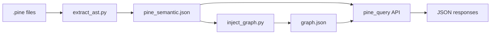

# Architecture Overview — Pine Semantic Layer v1.0

## System Context

```
Pine Script v6  →  extract_ast.py  →  pine_semantic.json  →  inject_graph.py  →  graph.json
                                                              →  pine_query      →  Query API
```

The Semantic Layer has three components:
1. **Extractor** (`extract_ast.py`) — parses `.pine` files using pynescript (ANTLR), outputs `pine_semantic.json`.
2. **Injector** (`inject_graph.py`) — reads `pine_semantic.json`, injects nodes/edges into Graphify `graph.json`.
3. **Query Engine** (`pine_query`) — loads `pine_semantic.json` + `graph.json`, provides 11 query types via Python API + CLI.

## Key Architectural Decisions

| Decision | Rationale |
|---|---|
| `pine_semantic.json` is SSOT | All consumers derive from it; no secondary source of truth |
| Python API first, CLI second | AI agents (Claude, OpenCode, n8n) import directly |
| Structural explain (no LLM) | Deterministic, testable, zero-cost; LLM is optional extension |
| Schema versioning | Consumer validates compatibility at load time |
| Query registry | New queries register transparently; CLI/MCP auto-discover |

## Data Flow



## Performance Targets (v1.0 Baseline)

| Operation | Target | Measured |
|---|---|---|
| Parse project | <5 min | ~2.5 min |
| SemanticDB load | <0.5s | 0.01-0.03s |
| Query | <5ms | 0.0-0.5ms |
| Context assembly | <30ms | 0.1ms |

## API Surface

See [query-api.md](query-api.md) for full documentation.

Stable (v1.0):
- `SemanticDB` — load/index constructor
- `QUERY_REGISTRY` — 11 query callables

Internal (may change):
- `pine_query.queries.*`, `pine_query.formatter`, `pine_query.database`, `pine_query.builtin`
